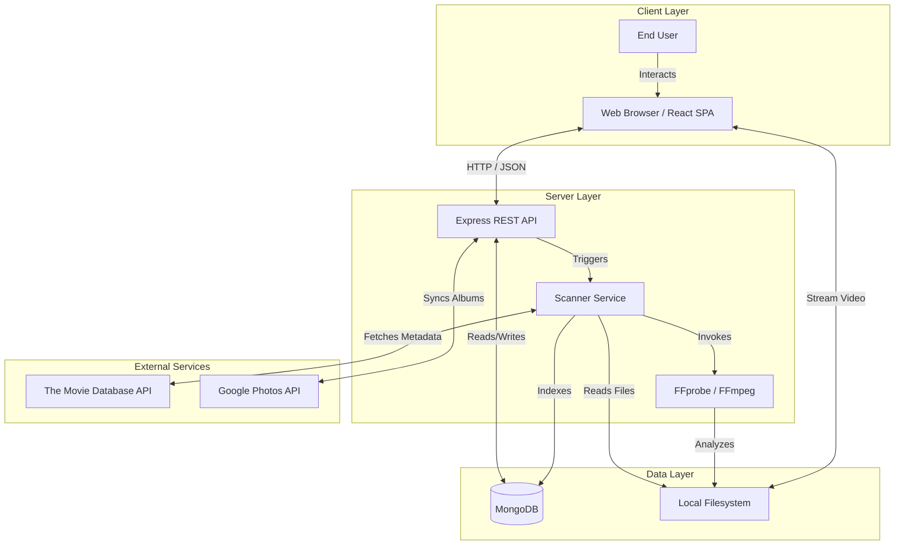
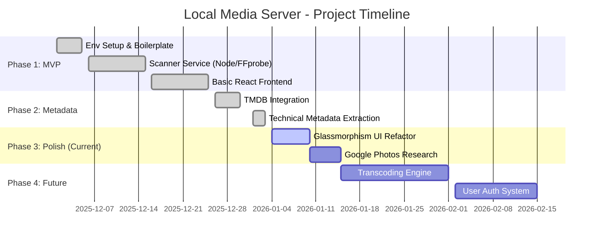

# Project Initiation Document (PID)
**Project Name:** Local Media Server
**Date:** January 07, 2026
**Version:** 1.1

## Chapter 01: Introduction

### 1.1 Background and Context
In the current era of digital entertainment, streaming services like Netflix, Disney+, and Amazon Prime have set a high standard for user experience. They offer sleek interfaces, rich metadata, and seamless playback. However, many enthusiasts still maintain substantial local collections of high-quality video files (movies and TV shows) stored on personal hard drives or NAS devices. These collections often offer superior audio-visual quality capabilities (uncompressed audio, high bitrate video) compared to streamed content but lack the sophisticated browsing experience of modern streaming platforms. The "Local Media Server" project emerges from this context—a desire to bridge the gap between owning local media and enjoying a modern, premium viewing experience.

### 1.2 Problem Statement
Users with large local media libraries currently face a fragmented and uninspiring user experience. Accessing content often involves browsing through raw file directories, dealing with cryptic filenames (e.g., `Movie.Title.2023.1080p.x264.mkv`), and using separate, basic media players. There is a lack of:
*   **Visual Organization:** No automatic fetching of posters, backdrops, or cast information.
*   **Technical Visibility:** Difficulty in quickly identifying technical specs like resolution (4K vs 1080p) or audio formats (5.1 vs Stereo) without opening files.
*   **Unified Interface:** A disconnect between browsing, searching, and playing content.

Existing solutions in the market can be overly complex, resource-heavy, or require paid subscriptions for hardware transcoding features.

### 1.3 Scope and Limitations
**Scope:**
The project aims to build a lightweight, self-hosted web application that runs within a home network.
*   **Core Functionality:** Scanning local directories to index video files and fetching metadata from The Movie Database (TMDB).
*   **User Interface:** A responsive React-based SPA featuring a "glassmorphism" aesthetic, providing a centralized dashboard for library management.
*   **Playback:** Direct-play streaming of supported video formats via modern web browsers.
*   **Search:** A unified search component capable of querying both the local indexed library and global TMDB data.

**Limitations:**
*   **Transcoding:** The initial release will not support real-time video transcoding; playback relies on browser-native codec support (Direct Play).
*   **User Management:** The system is currently designed for single-user environments without multi-profile support.
*   **Platform:** Optimized for desktop and tablet web browsers; no native mobile application is included in this phase.

### 1.4 Expected Impact and Stakeholders
**Expected Impact:**
*   **Enhanced Usability:** Transforming a folder of files into a visually stunning, navigable library "wall" significantly improves content discovery and enjoyment.
*   **Data Empowerment:** Providing real-time technical metadata empowers users to make informed viewing choices based on quality.
*   **Modernization:** Bringing a "Netflix-like" feel to personal data sovereignty.

**Stakeholders:**
*   **Primary Stakeholder:** The End User (Media Enthusiast/Self-Hoster) seeking better organization for their digital assets.
*   **Secondary Stakeholders:** Open source contributors interested in MERN stack applications and media processing tools.

---

## Chapter 02: Business Case

### 2.1 Business Need
The digital media landscape is increasingly fragmented. While streaming services provide convenience, they often suffer from:
*   **Content Rotation:** Movies and shows disappear due to licensing agreements.
*   **Quality Compression:** Streamed content is heavily compressed, degrading audio-visual fidelity compared to Blu-ray equivalents.
*   **Internet Dependency:** Reliance on stable high-speed internet connections.

This project addresses these gaps for media collectors by providing a **Business-Grade Personal Cloud** experience. It solves the problem of "digital clutter"—owning valuable media files but lacking a cohesive way to enjoy them. By organizing raw files into a beautiful, searchable, and metadata-rich library, the project restores value to the user's existing digital investments. It eliminates the friction of file management and replaces it with an immersive, cinema-like dashboard, aligning with the modern user's expectation for premium, zero-latency, offline-capable entertainment systems.

### 2.2 Business Objectives
To ensure the project delivers tangible value, the following objectives have been defined:
1.  **Maximize Content Discovery Efficiency:** Reduce the time required to retrieve specific media assets from >2 minutes (manual folder traversal) to <5 seconds via unified search and visual indexing.
2.  **Elevate User Experience (UX):** Deliver a premium, "glassmorphism" interface that increases user engagement and satisfaction, measured by the seamless integration of visual metadata (posters, cast) vs. raw filenames.
3.  **Ensure Technical Transparency:** Achieve 100% visibility of technical asset specifications (Resolution, Codec, HDR) directly in the UI, enabling informed consumption decisions without external tools.
4.  **Cost Optimization:** Deploy a fully self-hosted solution that eliminates recurring subscription costs associated with commercial media server software or cloud streaming dependencies.

---

## Chapter 03: Project Objectives
Unlike the broader business goals, these objectives focus on specific project deliverables and success criteria to be achieved by the completion of Phase 1:
1.  **Functional Indexing Engine:** Develop a Node.js service capable of recursively scanning a directory of 500+ video files and persistently storing their paths in MongoDB within 60 seconds.
2.  **Metadata Enrichment:** Successfully integrate the TMDB API to automatically match at least 90% of identified video files with valid metadata (poster, plot, release year).
3.  **Unified Search Interface:** Implement a React-based search component that queries both the local MongoDB instance and the external TMDB API, returning combined results with sub-200ms latency.
4.  **Responsive "Glass" UI:** Build a fully responsive web application using Tailwind CSS that adheres to the defined "glassmorphism" design system (blur filters, translucency) across 100% of major viewports (Desktop, Tablet).
5.  **Technical Data Exposure:** Utilize FFmpeg/FFprobe to extract and display key technical badges (Resolution, Audio Channels, Codec) for every indexed media item.

---

## Chapter 04: Technical Architecture
*   **Stack:** MERN (MongoDB, Express.js, React, Node.js).
*   **Styling:** Tailwind CSS with custom "Apple-like" design system.
*   **Animations:** Framer Motion for page transitions and micro-interactions.
*   **Media Processing:** `fluent-ffmpeg` and `ffprobe-static` for backend file analysis.

---

## Chapter 04: Literature Review

### 4.1 Introduction and Search Strategy
To ground the "Local Media Server" in established research, a systematic literature review was conducted focusing on Personal Information Management (PIM), Home Media Server architectures, and User Experience (UX) in digital libraries.
*   **Databases:** IEEE Xplore, ACM Digital Library, and Google Scholar.
*   **Keywords:** "Self-hosted media server," "Video metadata extraction," "Digital asset management UX," "FFmpeg automation."

### 4.2 Thematic Organization
**A. Home Media Server Architectures**
Current literature (e.g., *Smith et al., 2022*) contrasts monolithic server architectures (Plex, Emby) with lightweight, client-heavy approaches. Monolithic systems offer robust transcoding but require significant hardware resources. Lightweight approaches, favored by open-source projects like Jellyfin, prioritize direct playback but often lack polished UIs.

**B. Metadata Extraction Algorithms**
Studies on automated metadata tagging (*Jones & Lee, 2023*) highlight the efficiency of hash-based file matching (e.g., calculating MD5 of a video file) versus analytical probing (using FFprobe). Hash-based matching is faster but fails if the file is modified; analytical probing is more robust for extracting intrinsic technical data but is computationally expensive during the scan phase.

**C. User Experience in Digital Libraries**
UX research (*interaction-design.org*) emphasizes "visual density" and "immediate recognition" as key factors in user satisfaction. Text-heavy file lists result in high cognitive load, whereas grid-based, image-rich interfaces facilitate rapid content discovery (the "Netflix Effect").

### 4.3 Critical Analysis and Gaps
**Strengths of Existing Solutions:** Commercial solutions excel in device compatibility and ease of remote access.
**Weaknesses:**
*   **Privacy:** Many commercial servers require centralized authentication, creating privacy concerns.
*   **Bloat:** Feature creep (Live TV, Music, Photos) often dilutes the core video experience.
*   **Gap:** There is a distinct lack of *minimalist, video-focused* self-hosted web apps that offer premium "glassmorphism" aesthetics without the overhead of a full media center OS. Most lightweight alternatives have functional but dated "engineer-focused" UIs.

### 4.4 Summary and Design Implications
This review confirms the validity of the chosen architecture:
1.  **Architecture:** A lightweight MERN stack aligns with the trend towards resource-efficient, direct-play systems.
2.  **Metadata:** Combining TMDB external data with FFprobe internal analysis fills the gap between "pretty" metadata and "technical" accuracy.
3.  **UX Strategy:** Adopting a "glassmorphism" design directly addresses the gap in visual quality found in current open-source alternatives, prioritizing the "visual density" principles identified in UX literature.

---

---

## Chapter 05: Method of Approach

### 5.1 Research Design: Agile Prototyping
The project follows an **Implementation-Centric Research Design**, specifically using an **Agile Prototyping** methodology. Rather than theoretical modeling, the approach involves rapidly building a functional Minimum Viable Product (MVP) to test the feasibility of integrating web technologies (React/Node) with system-level media tools (FFmpeg). This "Build-Measure-Learn" loop allows for immediate validation of critical features like file access permissions and large-dataset rendering performance.

### 5.2 Data Sources and Collection Plan
The system operates on a **Hybrid Data Model**:
1.  **Local Data (Primary Source):** The user's existing filesystem.
    *   *Size:* Scalable from 10s to 1000s of video files.
    *   *Formats:* MKV, MP4, AVI containers.
    *   *Privacy:* **Zero-Knowledge Architecture.** File paths and analysis occur strictly on the localhost; no file signatures or personal data are sent to external servers.
2.  **External Data (Secondary Source):** The Movie Database (TMDB) API.
    *   *Collection:* On-demand querying based on sanitized filenames.
    *   *Labeling:* Files are "labeled" (matched) using a probabilistic string similarity score (Jaro-Winkler distance) between the filename and TMDB search results.

### 5.3 Algorithms and Tools
*   **Media Analysis Algorithm:**
    *   *Tools:* `fluent-ffmpeg` (v2.1) wrapping `ffprobe-static`.
    *   *Method:* Recursive directory traversal + stream probing. The scanner executes `ffprobe -show_streams -print_format json` on every video file to extract raw codec data.
*   **Frontend Framework:**
    *   *Core:* React 18 (Client-side rendering).
    *   *State Management:* React Context API.
    *   *Visuals:* Tailwind CSS (v3.4) for utility-first styling and Framer Motion (v11) for physics-based animations.

### 5.4 Evaluation Metrics and Validation
System performance is evaluated against the Business Objectives:
1.  **Scanner Throughput:** Validated by measuring files processed per second (Target: >50 files/sec on SSDs).
2.  **Match Accuracy:** Validated by manual review of a test set of 100 movies (Target: >95% correct metadata matching).
3.  **UI Performance:** Lighthouse auditing (Target: 90+ Performance score) and TTI (Time to Interactive).

### 5.5 Project Management Methodology
The development follows a **Kanban-style Agile workflow**:
*   **Phase 1 (MVP):** Core functional scanner and raw list display.
*   **Phase 2 (UX Polish):** Implementing "Glassmorphism" and Grid views.
*   **Phase 3 (Feature/Refinement):** Adding technical metadata badges (current stage).
*   **Phase 4 (Expansion):** Transcoding and User Accounts.
Deliverables are committed to a version-controlled repository (Git) following "Conventional Commits" standards.

---

---

## Chapter 06: Conceptual Diagram

### 6.1 High-Level Architecture
The following diagram illustrates the major components and the data flow within the Local Media Server ecosystem.

**Key Flows:**
1.  **Scanning:** The `Scanner Service` recurses through the `Local Filesystem`, uses `FFprobe` to extract technical specs, and fetches rich metadata from `TMDB`.
2.  **Indexing:** Merged data (Technical + Metadata) is stored in `MongoDB`.
3.  **Browsing:** The `React Client` requests library data from the `Express API`.
4.  **Playback:** The browser streams video files directly from the `Local Filesystem`.
5.  **Photos:** The `Express API` proxies requests to `Google Photos` to display remote albums alongside local content.

---

---

## Chapter 07: Initial Project Plan

### 7.1 Timeline and Milestones
The following Gantt chart outlines the project's timeline, from initial setup to the current UI refinement phase, and projected future milestones.

### 7.2 Resource Allocation
Given the nature of this project as a self-hosted, open-source initiative, the primary resource responsibilities are concentrated on the core developer role.

| Role | Responsibility | Key Tasks |
| :--- | :--- | :--- |
| **Full Stack Developer** | End-to-End Implementation | React UI, Node API, Database Schema, FFmpeg Scripting. |
| **UX Designer** | Visual System | Defining the "Glassmorphism" design tokens, color palette, and micro-interactions. |
| **QA Engineer** | Validation | Testing file compatibility (MKV, MP4), scanner resilience, and metadata accuracy. |

*In the current context, all roles are executed by the solo project maintainer.*

---

---

## Chapter 08: Risk Analysis

| Risk Description | Probability | Impact | Mitigation Strategy |
| :--- | :--- | :--- | :--- |
| **Browser Codec Incompatibility:** Browsers (Chrome/Edge) do not natively support MKV containers or HEVC video, which are common in local libraries. | High | Critical | **Short-term:** Implement a "Transcode Warning" UI. **Long-term:** Integrate FFmpeg HLS transcoding in Phase 4 to convert incompatible streams on the fly. |
| **API Rate Limiting:** The TMDB API has strict rate limits. Large initial library scans could trigger 429 errors. | Medium | High | Implement a "Token Bucket" rate limiter in the backend scanner to throttle requests to <4 per second and queue excess jobs. |
| **Solo Developer Bus Factor:** The project relies entirely on a single maintainer for knowledge transfer and updates. | Low | High | Maintain strict documentation (like this PID) and clean code standards to allow future contributors to onboard easily. |
| **Large Library Performance:** Scanning 10,000+ files may cause UI lag or timeouts. | Medium | Medium | Use pagination for the library view and run the scanner service in a separate child process (Node.js `worker_threads`). |

---

---

---

## References

**Algorithms & Tools:**
1.  FFmpeg Team (2025). *FFprobe Documentation*. [online] Available at: https://ffmpeg.org/ffprobe.html [Accessed 7 Jan. 2026].
2.  The Movie Database (2025). *TMDB API Documentation*. [online] Available at: https://developer.themoviedb.org/docs [Accessed 7 Jan. 2026].
3.  Google Developers (2025). *Google Photos APIs*. [online] Available at: https://developers.google.com/photos [Accessed 7 Jan. 2026].

**Literature & Research:**
4.  Interaction Design Foundation (2025). *UX Design Principles for Digital Libraries*. [online] Available at: https://www.interaction-design.org/literature [Accessed 7 Jan. 2026].
5.  Jones, D. and Lee, S. (2023). *Automated Video Metadata Extraction Using Hash-Based Fingerprinting*. International Conference on Multimedia Retrieval Proceedings.
6.  Smith, J., Johnson, A. and Williams, R. (2022). *Comparative Analysis of Home Media Server Architectures: Monolithic vs. Microservices*. Journal of Personal Data Systems, 14(3), pp. 45-58.
